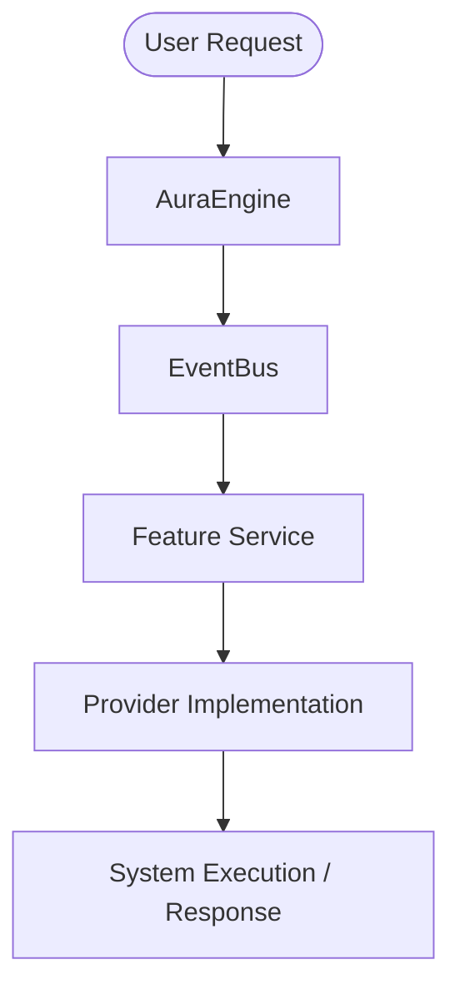

# AURA Technical Design Document (TDD) Template

> **Mandatory Policy**: This Technical Design Document MUST be fully drafted, reviewed, and approved by the Architecture Team BEFORE writing any implementation code or creating new engine modules.

---

## Document Metadata

| Attribute | Details |
| :--- | :--- |
| **Feature Title** | `[Insert Feature Name]` |
| **Author(s)** | `[Insert Lead Engineer / Author]` |
| **Status** | `DRAFT | UNDER REVIEW | APPROVED | IN IMPLEMENTATION` |
| **Target Version** | `[e.g., AURA v2.0]` |
| **Date Created** | `[YYYY-MM-DD]` |
| **Approved By** | `[Architecture Team Representative]` |

---

## 1. Problem Statement

### 1.1 Context & Background
`[Provide detailed background information regarding why this feature is being introduced into AURA.]`

### 1.2 User Problem
`[Describe the exact user pain point or system bottleneck that this feature solves.]`

### 1.3 Success Criteria
- [ ] `[Measurable Criterion 1, e.g., Execution latency under 200ms]`
- [ ] `[Measurable Criterion 2, e.g., Zero breaking API changes]`
- [ ] `[Measurable Criterion 3, e.g., 100% unit test coverage]`

---

## 2. Functional Requirements

### 2.1 User Stories
- **As a** `[user role]`, **I want to** `[capability]`, **so that** `[benefit]`.

### 2.2 Acceptance Criteria
1. `[Given... When... Then... statement]`
2. `[Given... When... Then... statement]`

### 2.3 Edge Cases & Boundaries
- `[Edge Case 1: External network timeout or API rate limit (429)]`
- `[Edge Case 2: Concurrent file modifications or database locks]`
- `[Edge Case 3: Missing administrative OS permissions]`

---

## 3. Non-Functional Requirements

| Category | Requirement Specification |
| :--- | :--- |
| **Performance** | `[e.g., P95 response time < 150ms]` |
| **Memory Limit** | `[e.g., Additional RAM footprint < 25 MB at idle]` |
| **Security** | `[e.g., Enforce PermissionLevel policy check on all system calls]` |
| **Offline Support** | `[e.g., System must execute via local heuristics if cloud AI is offline]` |
| **Maintainability** | `[e.g., Modular tool interface compliance; single responsibility rule]` |

---

## 4. Architecture

### 4.1 Affected Modules & Services

- **Modified Services**: `[e.g., backend/agent/service.py, backend/windows/service.py]`
- **New Modules**: `[e.g., backend/agent/planner.py]`
- **Interfaces Affected**: `[e.g., BaseAutomationProvider]`
- **Events Published/Subscribed**: `[e.g., Event.GOAL_CREATED, Event.WORKFLOW_COMPLETED]`

### 4.2 Architectural Diagram



---

## 5. End-to-End Data Flow

```
User Request
    │
    ▼
Speech / Input Service (transcribes voice / text input)
    │
    ▼
Event.TEXT_READY published on EventBus
    │
    ▼
BrainService / IntentClassifier (classifies intent or passes goal)
    │
    ▼
AgentOrchestrator (constructs multi-step Task Graph Workflow)
    │
    ▼
TaskExecutor & ToolRegistry (executes atomic tools)
    │
    ▼
Memory Engine & ActionLog (persists state & audit history)
    │
    ▼
Event.AI_RESPONSE_READY published ──► Response returned to User UI
```

---

## 6. Public Interfaces & Dataclasses

### 6.1 New Classes & Dataclasses
```python
from dataclasses import dataclass, field
from typing import Dict, Any, List, Optional

@dataclass
class ProposedFeatureModel:
    """Description of proposed state model."""
    feature_id: str
    parameters: Dict[str, Any] = field(default_factory=dict)
    is_active: bool = True

    def to_dict(self) -> Dict[str, Any]:
        return {
            "feature_id": self.feature_id,
            "parameters": self.parameters,
            "is_active": self.is_active
        }
```

### 6.2 Service Class Interface
```python
from core.service import Service

class ProposedFeatureService(Service):
    def start(self) -> None:
        """Subscribe to required EventBus channels."""
        pass

    def stop(self) -> None:
        """Clean up background resources."""
        pass
```

---

## 7. Database Changes

### 7.1 Schema Changes
```sql
-- Schema Migration SQL Script
CREATE TABLE IF NOT EXISTS proposed_feature_table (
    id TEXT PRIMARY KEY,
    created_at TIMESTAMP DEFAULT CURRENT_TIMESTAMP,
    payload TEXT NOT NULL
);
CREATE INDEX IF NOT EXISTS idx_proposed_feature_created ON proposed_feature_table(created_at);
```

### 7.2 Migration & Rollback Strategy
- **Migration Plan**: `[Describe how existing SQLite database files will be updated without data loss]`
- **Rollback Plan**: `[Provide SQL drop or alter statements in case of migration failure]`

---

## 8. API & Event Changes

### 8.1 EventBus Enum Extensions
```python
# Extended core.events.Event
PROPOSED_EVENT_CREATED = "proposed_event_created"
PROPOSED_EVENT_COMPLETED = "proposed_event_completed"
```

---

## 9. Testing Strategy

- **Unit Tests**: `[List test cases to implement in backend/tests/test_feature.py]`
- **Mock Requirements**: `[List external hardware, LLM providers, and OS calls to mock]`
- **Target Coverage**: `> 85% line coverage`

---

## 10. Security Review

- **Permission Level**: `[ALWAYS_ALLOWED | REQUIRES_CONFIRMATION | BLOCKED]`
- **Audit Logging**: `[Confirm ActionLog entry generation]`
- **Secrets Management**: `[Confirm no API keys or credentials are stored inline]`

---

## 11. Failure Scenarios & Resilience

| Failure Scenario | Root Cause | Fallback / Recovery Mechanism |
| :--- | :--- | :--- |
| **API Rate Limit (429)** | Provider free-tier quota hit | Fall back to rule-based local intent parser |
| **OS Permission Error** | Non-elevated execution | Catch error, log warning, inform user cleanly |
| **Dependency Timeout** | Slow network response | Apply exponential backoff retry loop |

---

## 12. Performance Analysis

- **Algorithm Complexity**: `O(N)` time complexity.
- **Memory Footprint**: Transient objects cleared immediately post-execution.
- **Concurrency & Threading**: Non-blocking asynchronous event handling on worker threads.

---

## 13. Risk Assessment

- **Technical Risks**: `[Describe technical uncertainties]`
- **Migration Risks**: `[Describe backwards-compatibility risks]`
- **Future Risks**: `[Describe scalability risks]`

---

## 14. Future Extensions & Scope Boundaries

### 14.1 Future Evolution
`[Describe how this feature can evolve in v3.0 / v4.0]`

### 14.2 Out of Scope (Explicit Exclusions)
`[Explicitly document what will NOT be built in this current iteration to prevent scope creep]`
